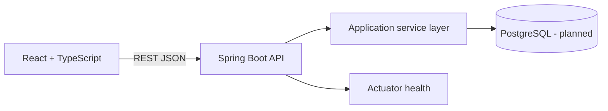

# Architecture

Nexora uses a small monorepo so the product story is easy to inspect without pretending that a portfolio project is a distributed enterprise platform.

## Boundaries

- `frontend/src/components` owns presentation and interaction primitives.
- `frontend/src/data.ts` provides safe demo data until API wiring is enabled.
- `backend/controller` owns HTTP boundaries.
- `backend/service` owns application behavior.
- `backend/model` defines the current domain shape.
- `ops` contains local container orchestration only.

## Tradeoff
The first increment uses in-memory service data so a reviewer can run the API immediately. PostgreSQL and migrations are the next boundary, not a hidden dependency.
